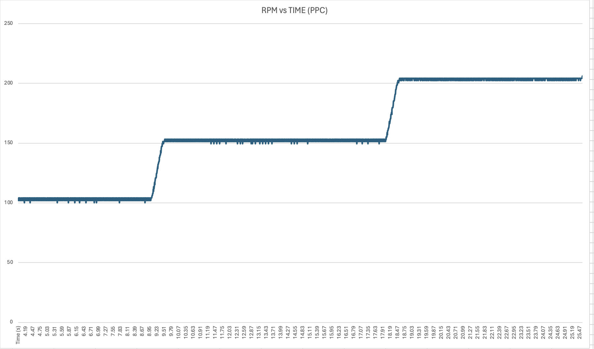

# Prescribed-Performance-Control-vs-PID-Control-of-DC-Motor

## Introduction
This project explores the implementation and comparison of two control algorithms, Prescribed Performance Control (PPC) and Proportional-Integral-Derivative (PID) control, for regulating the speed of a DC motor. The control algorithms are implemented using Teensy 4.1 microcontroller and interfaced with MD30CR2 Motor Driver (30A) for controlling the DC motor.

## Hardware Setup
Teensy 4.1 Microcontroller: The Teensy 4.1 board serves as the control unit for executing the control algorithms and generating PWM signals to control the motor speed.
MD30CR2 Motor Driver (30A): This motor driver is used to interface the Teensy with the DC motor, providing the necessary power and control signals.

## Software Setup
Arduino IDE: Install the Arduino IDE on your development machine.
Teensyduino Add-on: Install the Teensyduino add-on for Arduino IDE to enable programming of the Teensy board.

## Control Algorithms
### Prescribed Performance Control (PPC)

### Proportional-Integral-Derivative (PID) Control
Description of the PID control algorithm implementation.
Tuning PID parameters (Kp, Ki, Kd) for desired speed regulation.
Comparison of PID control with PPC in terms of performance and stability.

## Results

